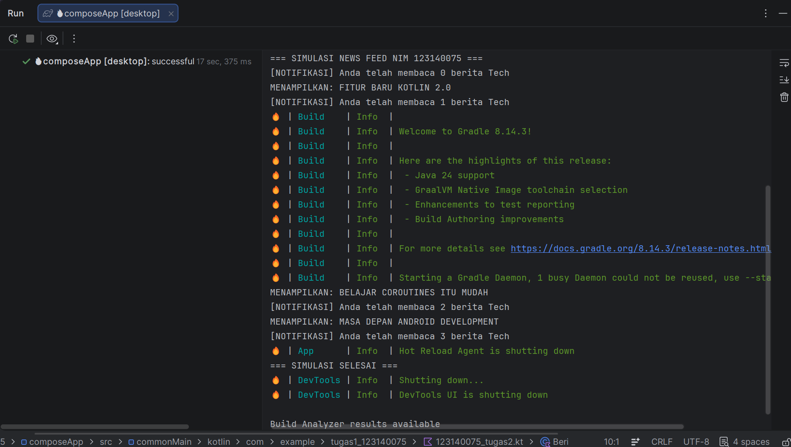

# News Feed Simulator - Tugas 2 Pemrograman Mobile

Aplikasi simulasi News Feed sederhana yang dibangun menggunakan **Kotlin Multiplatform** dengan fokus pada penerapan Coroutines, Flow, dan State Management.

## Identitas Mahasiswa
* **Nama:**   Muhammad Farhan Muzakhi
* **NIM:** 123140075
* **Kelas:** PAM RA

## Fitur Aplikasi
Sesuai dengan kriteria tugas, aplikasi ini mencakup:
1. **Asynchronous Data Stream (Flow):** Mensimulasikan pengiriman data berita setiap 2 detik secara berkelanjutan.
2. **Filtering:** Memfilter berita secara otomatis hanya untuk kategori tertentu (Contoh: "Tech").
3. **Data Transformation:** Mengubah objek data mentah menjadi format tampilan string yang siap dibaca.
4. **State Management (StateFlow):** Menyimpan dan memantau status jumlah berita yang telah dibaca pengguna secara real-time.
5. **Concurrency (Coroutines):** Menjalankan proses pengambilan detail berita dan pemantauan notifikasi secara asinkron menggunakan `launch` dan `runBlocking`.

## Cara Menjalankan
1. Clone repositori ini.
2. Buka di **Android Studio Ladybug** atau versi terbaru.
3. Cari file `123140075_tugas2.kt` di folder `commonMain/kotlin`.
4. Klik ikon **Run (Segitiga Hijau)** pada fungsi `main()`.

## Output Simulasi
Aplikasi akan menampilkan log di terminal berupa judul berita yang masuk dan notifikasi jumlah berita yang sudah dibaca hingga simulasi dinyatakan selesai.
## Bukti Output Program
Berikut adalah cuplikan hasil eksekusi program:

